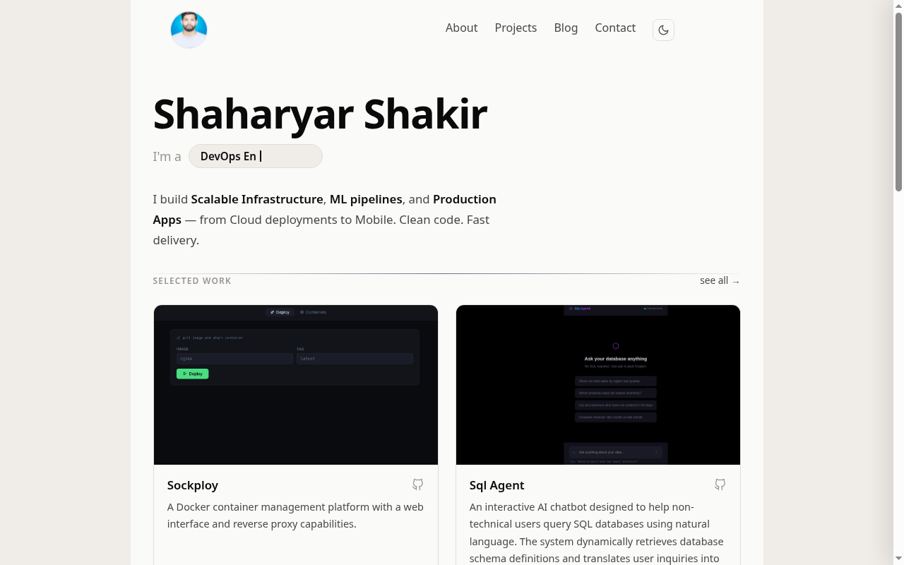

# Shaharyar Shakir — Developer Portfolio

<p align="left">
  <a href="https://portfolio.shaharyarshakir.workers.dev/"></a>
  <a href="https://svelte.dev/"></a>
  <a href="https://www.typescriptlang.org/"></a>
  <a href="https://tailwindcss.com/"></a>
  <a href="https://vitejs.dev/"></a>
  <a href="https://workers.cloudflare.com/"></a>
  
</p>



A modern, minimalist, and highly modular developer portfolio built with **Svelte 5**, **Tailwind CSS v4**, **TypeScript**, and **Vite**, deployed globally on **Cloudflare Workers**.

---

## ⚡ Tech Stack

| Technology | Badge | Description |
| :--- | :--- | :--- |
| **Svelte 5** |  | Modern reactive framework using Svelte Runes (`$state`, `$props`) |
| **TypeScript** |  | Strictly typed codebase & interfaces |
| **Tailwind CSS v4** |  | Utility-first CSS & custom CSS design tokens |
| **Vite** |  | Next-generation fast frontend tooling |
| **sv-router** |  | Fast client-side routing engine |
| **Cloudflare Workers** |  | Edge serverless deployment |
| **Bun** |  | Fast all-in-one JavaScript runtime & package manager |

---

## ✨ Features & Highlights

- 🎨 **Minimalist & Modern Aesthetic**: Clean typography, subtle micro-animations, theme toggle (Dark / Light mode).
- 🧩 **Modular Data & UI Architecture**: Clean separation between content (`src/lib/data/`), reusable UI components (`src/components/`), and pages (`src/routes/`).
- ⏱️ **Interactive Journey Timeline**: Responsive timeline showcasing career milestones, experience, and tech tags.
- 📁 **Project Showcase**: Rich project cards featuring tech badges, live links, and GitHub repository links.
- 📝 **Markdown Blog Engine**: Render markdown posts dynamically with syntax highlighting for code blocks.
- ✉️ **Contact Form Integration**: Interactive contact form powered by Formspree with instant feedback & status handling.
- ⚡ **Lightning Fast Load Times**: Built as an optimized bundle for Cloudflare's edge network.

---

## 📁 Project Structure

```
shakir-portfolio/
├── public/
│   ├── assets/                # Static images & project screenshots
│   └── portfolio-preview.png  # Live portfolio visual preview
├── src/
│   ├── components/            # Reusable UI components
│   │   ├── ContactForm.svelte   # Contact form with state & submission logic
│   │   ├── Currently.svelte     # Current status grid (studies, focus, location)
│   │   ├── Footer.svelte        # Site footer & copyright
│   │   ├── Hero.svelte          # Homepage header & introduction
│   │   ├── Navbar.svelte        # Navigation bar & route active states
│   │   ├── ProjectCard.svelte   # Project card item
│   │   ├── ProjectGrid.svelte   # Project grid layout
│   │   ├── SocialGrid.svelte    # Interactive social platform links
│   │   ├── TechScroll.svelte    # Animated technology stack carousel
│   │   ├── Timeline.svelte      # Experience & journey timeline
│   │   └── ThemeToggle.svelte   # Dark / Light theme switcher
│   ├── content/
│   │   └── blog/                # Markdown blog posts
│   ├── lib/
│   │   ├── data/                # Strongly-typed static content modules
│   │   │   ├── profile.ts       # Bio, timeline entries, status items
│   │   │   ├── projects.ts      # Project collection & metadata
│   │   │   └── socials.ts       # Social channels & icons
│   │   ├── icons/               # Tech stack icon definitions
│   │   ├── stores/              # Theme store & app state
│   │   └── utils/               # Markdown parser & blog utilities
│   ├── routes/                  # Route components
│   │   ├── index.svelte         # Home page (`/`)
│   │   ├── about.svelte         # About page (`/about`)
│   │   ├── project.svelte       # Projects showcase page (`/project`)
│   │   ├── blog.svelte          # Blog listing page (`/blog`)
│   │   ├── blog.[slug].svelte   # Single blog post page (`/blog/:slug`)
│   │   └── contact.svelte       # Contact page (`/contact`)
│   ├── App.svelte               # Root component & layout wrapper
│   ├── app.css                  # Global design tokens & styling
│   └── main.ts                  # Application entry point
├── svelte.config.js             # Svelte preprocessor configuration
├── vite.config.ts               # Vite configuration & plugin setup
└── package.json                 # Project dependencies & scripts
```

---

## 📄 License

MIT © [Shaharyar Shakir](https://github.com/ShaharyarShakir)
